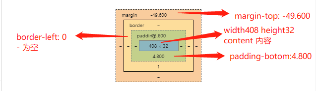

# CSS盒子

##  四大盒子

**content + padding + border + margin = box**  

```
 boder + padding + content = width
```





## content

### 替换元素

* 以前盒子元素分为**内联元素**和**块级元素**

* 替换元素，css世界的另外一个派系，根据是否具有可替换内容，分为**替换元素**和**非替换元素**
* 通过修改某个属性值呈现不同的内容，就叫**替换元素**

```

<input value='替换元素'>
```

img, object, video, iframe, input, textarea, canvas, select, button

### 特性

* 内容可以替换
* 内容的外观不受页面上的css影响
* 拥有自己的尺寸`wdith ` `height` `size` `cols` `rows` 属性

* 元素的基线为**元素的下边缘**，非`baseline`


## 温和的padding

### 属性值:  `px | %`

*  px `padding-left: 10px;`

*  % `padding: 50%; // 正方形`  

  `相当于继承父容器的width的50%，天然的适合自适应布局`  

  `padding-top: 50%;` === `height: 50%;`  

  `padding-left: 50%;` === `widht: 50%;`  

  `padding: 25% 50%;` === `宽高比 2:1 的矩形`  

* 

  
  <Work-Padding/>

* 内联元素padding 断行 `eg:a`  
  
* 内联元素padding 产生`strut 幽灵空白点` `eg:b`

  ```
    span {
      padding: 50%;
      font-size: 0; // clear strut
      background: #bfb5b5;
    }  
  ```

### 作用

* 对于非替换元素的内联元素，padding，margin和border，不会影响布局，不会加入盒子高度的计算，但实际上内联盒子发生了渲染，可以用来增加点击范围增大。

  <h3 id="sub" onclick="alert('戳中我了~~')"><span style="padding-top: 100px;">我有100的padding，戳我下试试</span></h3>

```
 <!-- 需求：锚点的位置距离窗口50px -->

 <a href="#sub">链接——标题</a>
 <h3 id="sub" onclick="alert('戳中我了~~')"><span>标题</span></h3>
 h3 > span {
   padding-top: 50px;
 }

h3 {
  padding-top: 50px; // 会影响布局
}
```

## 激进的margin

### 特点

* 负责外边距

* 具有流体布局特性`CSS世界默认的流方向是水平方向`
  
* margin与padding 相辅相成
  
* margin属性值：`px | %`，相对父容器，与`padding` 一样
  
* margin可以合并

* margin: auto的理解
  

<Work-Margin />

### margin 合并

**合并条件**

* 块级元素，不包括`浮动和绝对定位`，不是伪类块

* `top` 和 `bottom` 只发生在垂直方向；不考虑`writing-mode`

<Work-Margin-MG01 />

**margin合并场景**

* 相邻兄弟合并

* 父级和子元素的第一个和最后一个合并

* 空块级元素

```
<div></div>
<style>
div {
  margin: 20px;
}
</style>
```

**阻止margin合并**

* 父元素为块状格式化上下文，`overflow: hidden;`
  
* 父元素设置`padding-top` 和 `padding-bottom`
* 
* 父元素设置`border-top` 和 `border-bottom`

* 父元素和第一个或者最后一个子元素之间，添加内联元素，伪元素
  
* `margin-bottom` 合并，父元素设置 `height、min-height、max-height`

* `margin`合并会造成头图掉``下来的问题
  
* 空元素`margin`合并添加内联元素

**margin合并规则**

* 正正取大，正负相加，负负最负

**margin合并的意义**

  css世界设计的本意是**图文信息展示**，让图文信息的排版更加舒服自然，这页面中任何地方嵌套或者直接放入一个任何裸`div`,都不会影响原来的块状布局和排版。

**深入理解margin:auto**

`margin:auto`填充的规则

* 一侧定值，一侧`auto`,则`auto`为剩余空间大小

* 两侧`auto`,则平分剩余空间

* 特性：`margin: auto;`就是为块级元素左中右对齐而设计的
  
* 左右`auto`生效，**有宽度或者格式化宽度**

* 垂直方向`auto`居中

  * 格式化宽度和格式高度
    ```
    postion: absolute;
    top: 0;
    left: 0;
    right: 0;
    bottom: 0;
    margin: auto;
    ```
`margin`实现右对齐

<Work-Margin-MG02 />

### 功勋卓越的border

**border的属性值**

* `border: 1px solid currentColor` `currentColor` 为默认值

* border-width

* border-style

* border-color


